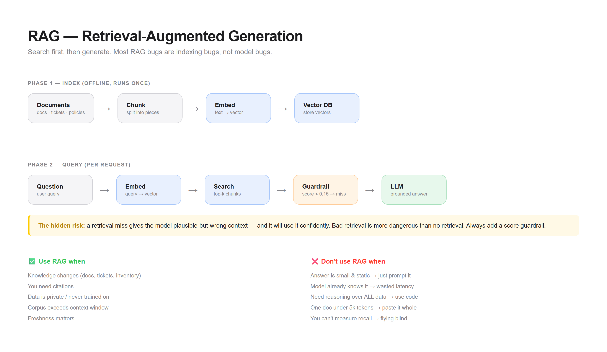

# Pattern 01 — RAG (Retrieval-Augmented Generation)

> **The confusion:** "When do I need retrieval, and when is it just a prompt?"



---

## What is it?

RAG puts a **search step before the model call**. Instead of hoping the model knows the answer, you fetch the relevant context and hand it over.

```
┌──────────┐    ┌──────────────┐    ┌─────────────┐    ┌───────────┐
│  Query   │───▶│  Embedding   │───▶│  Vector DB  │───▶│  Top-K    │
│          │    │  (encode)    │    │  (search)   │    │  Chunks   │
└──────────┘    └──────────────┘    └─────────────┘    └─────┬─────┘
                                                             │
                        ┌────────────────────────────────────┘
                        ▼
              ┌───────────────────────┐
              │  Prompt = question    │
              │         + top-k docs  │
              └──────────┬────────────┘
                         ▼
                   ┌───────────┐
                   │    LLM    │───▶ Answer (grounded)
                   └───────────┘
```

**Two phases, easy to confuse:**

| Phase | When it runs | What it does |
|-------|-------------|--------------|
| **Index** | Offline, once | Chunk docs → embed → store vectors |
| **Query** | Per request | Embed question → search → inject → generate |

Most RAG bugs are **indexing** bugs, not model bugs.

---

## When do I use it?

✅ **Your knowledge changes** — docs, tickets, policies, inventory
✅ **You need citations** — "which source said this?"
✅ **The knowledge is private** — it was never in training data
✅ **It's bigger than the context window** — thousands of documents
✅ **You need freshness** — yesterday's data matters

---

## When do I NOT use it?

❌ **The answer is static and small** → just put it in the system prompt. RAG adds a database for nothing.

❌ **The model already knows it** → "What is the capital of France?" needs no retrieval. You're adding latency for zero accuracy gain.

❌ **You need reasoning over ALL the data** → "sum the total across all 10,000 rows." Retrieval gives you top-k, not everything. Use code execution instead.

❌ **The corpus is one document under ~5k tokens** → paste the whole thing. Chunking it will *lose* context and hurt accuracy.

❌ **You can't evaluate retrieval quality** → if you can't measure recall, you can't tell if RAG is helping or hurting. Build the eval first.

---

## The tradeoffs

| Dimension | Cost of adding RAG |
|-----------|-------------------|
| **Latency** | +100–500ms per query (embed + search) |
| **Cost** | Embedding calls + vector DB hosting |
| **Complexity** | Now you maintain an index, a chunker, and a sync pipeline |
| **Failure surface** | Retrieval miss → confident wrong answer |
| **Freshness debt** | Stale index = stale answers (needs a sync job) |

**The hidden risk:** RAG can make answers *worse*. A retrieval miss gives the model plausible-but-wrong context, and it will use it confidently. Bad retrieval is more dangerous than no retrieval.

---

## Runnable demo

See [`demo.py`](./demo.py) — a minimal RAG with a local in-memory vector store. No API keys required to understand the shape.

```bash
python demo.py
```

---

## Design checklist

Before you ship RAG, answer these:

- [ ] What's my **chunk size**, and did I test alternatives?
- [ ] What's my **top-k**, and does more context actually help?
- [ ] Do I **rerank** results before injecting?
- [ ] How do I detect a **retrieval miss** at runtime?
- [ ] What happens when the answer **isn't in the corpus**? (Does it say "I don't know"?)
- [ ] How do I **keep the index fresh**?
- [ ] Have I measured **recall** separately from answer quality?

If you can't answer #7, you're flying blind.

---

## Common variants

| Variant | Adds | Use when |
|---------|------|----------|
| **Hybrid search** | Keyword + vector | Exact terms matter (IDs, names) |
| **Reranking** | Second-stage scorer | Top-k has noise |
| **HyDE** | Generate hypothetical answer first | Queries are short/vague |
| **Parent-child chunks** | Small chunks, big context | Need precision *and* context |
| **GraphRAG** | Knowledge graph | Multi-hop relationships |

Start with plain vector RAG. Add variants only when you can name the failure they fix.

---

**Next:** [Tool Use →](../02-tool-use/)
