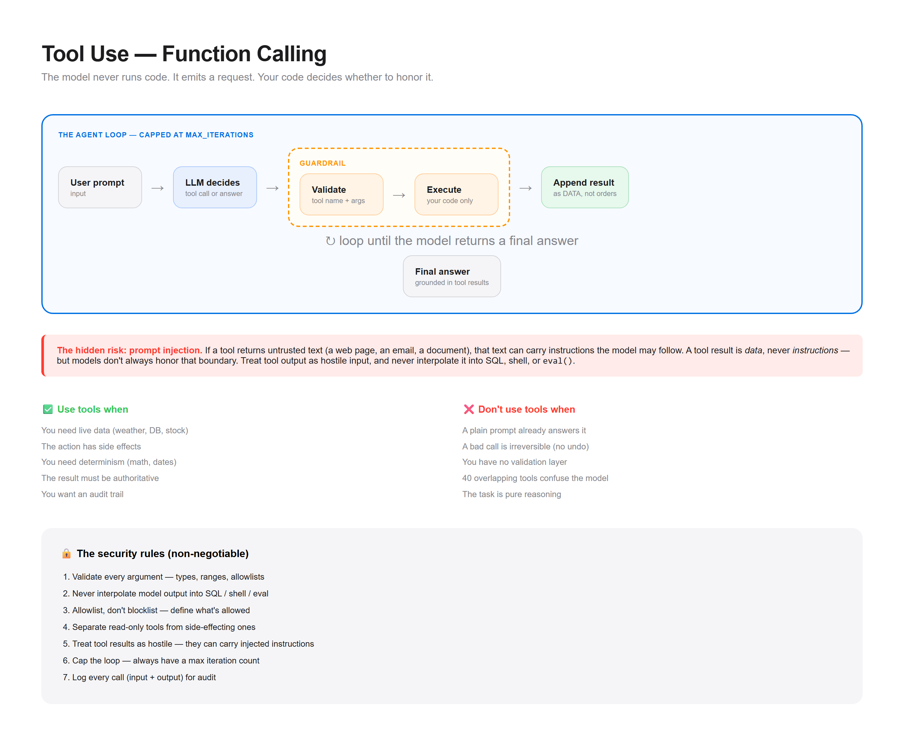

# Pattern 02 — Tool Use (Function Calling)

> **The confusion:** "How do I let a model take actions safely?"



---

## What is it?

Tool use gives the model **hands**. Instead of only producing text, it can request an action, you execute it, and the result flows back into the loop.

```
┌──────────┐    ┌──────────────┐    ┌──────────────┐
│  User    │───▶│     LLM      │───▶│  Tool call   │
│  prompt  │    │  (decides)   │    │  (JSON)      │
└──────────┘    └──────┬───────┘    └──────┬───────┘
                       │                    │
                       │              ┌─────▼──────┐
                       │              │  Validate  │  ← guardrail
                       │              └─────┬──────┘
                       │                    │
                       │              ┌─────▼──────┐
                       │              │  Execute   │
                       │              │  (your code)│
                       │              └─────┬──────┘
                       │                    │
                  ┌────▼────────────────────▼─────┐
                  │  Append result to messages    │
                  │  Loop until no more tool calls│
                  └───────────────┬───────────────┘
                                  ▼
                            ┌───────────┐
                            │  Final    │
                            │  answer   │
                            └───────────┘
```

**The key insight:** the model never runs code. It emits a *request*. Your code decides whether to honor it. That boundary is where all your safety lives.

---

## When do I use it?

✅ **The model needs live data** — weather, stock price, database row, order status
✅ **The action has side effects** — send email, create ticket, update record
✅ **You need determinism** — arithmetic, date math, unit conversion (don't let the model guess)
✅ **The result is authoritative** — a tool beats a hallucinated fact
✅ **You want an audit trail** — every action is a logged call

---

## When do I NOT use it?

❌ **A plain prompt already answers it** → "summarize this text" needs no tool. Adding one is pure latency.

❌ **The model can't recover from a bad call** → if a wrong tool call causes an irreversible action (payment, deletion) with no undo, don't expose it.

❌ **You have no validation layer** → never pass model output straight into `eval()`, SQL, or a shell. The model *will* eventually emit something malformed or malicious.

❌ **The tool list is huge and overlapping** → 40 tools with similar names makes the model pick wrong. Fewer, clearer tools beat more tools.

❌ **You can't afford the extra round-trips** → each tool call is a full model round-trip. A 3-tool chain is 4+ LLM calls of latency.

❌ **The task is pure reasoning** → "explain this concept" gains nothing from a tool.

---

## The tradeoffs

| Dimension | Cost of adding tools |
|-----------|---------------------|
| **Latency** | +1 LLM round-trip per tool call |
| **Cost** | Token cost scales with tool schemas + results |
| **Complexity** | Now you maintain tool schemas, validation, error handling |
| **Failure surface** | Wrong tool, bad args, tool timeout, infinite loop |
| **Security** | Every tool is an attack surface — prompt injection can trigger it |
| **Determinism** | Model chooses *which* tool — that choice is non-deterministic |

**The hidden risk:** **prompt injection**. If a tool returns untrusted text (a web page, an email, a document), that text can contain instructions the model may follow. A tool result is *data*, never *instructions* — but models don't always honor that boundary. Treat tool output as hostile input.

---

## Runnable demo

See [`demo.py`](./demo.py) — a tool-use loop with a validation guardrail and a loop limit. Stdlib only, no API keys.

```bash
python demo.py
```

---

## Design checklist

Before you ship tool use, answer these:

- [ ] Does every tool have a **clear, single purpose**?
- [ ] Do tool **descriptions** explain *when* to use it (not just what it does)?
- [ ] Is every argument **validated** before execution?
- [ ] Is there a **max iteration limit** to stop infinite loops?
- [ ] What happens on **tool failure** — does the model get told, or does it silently break?
- [ ] Are **side-effecting tools** separated from read-only ones?
- [ ] Do you **log every call** (input + output) for audit?
- [ ] Is **untrusted tool output** treated as data, never instructions?
- [ ] Is there a **human approval gate** for irreversible actions?

If you can't answer #8, you have a prompt-injection hole.

---

## Common variants

| Variant | Adds | Use when |
|---------|------|----------|
| **Single-shot** | One tool, one call | Simple lookup |
| **Loop (agentic)** | Repeat until done | Multi-step tasks |
| **Parallel calls** | Multiple tools at once | Independent lookups |
| **Human-in-the-loop** | Approval before execute | Irreversible actions |
| **Structured output** | Force JSON schema | Reliable parsing |

Start single-shot. Add the loop only when the task genuinely needs multiple steps.

---

## The security rules (non-negotiable)

1. **Validate every argument** — types, ranges, allowlists
2. **Never interpolate** model output into SQL/shell/eval
3. **Allowlist, don't blocklist** — define what's allowed, reject everything else
4. **Separate read from write** — read-only tools are safe; writes need gates
5. **Treat tool results as hostile** — they can carry injected instructions
6. **Cap the loop** — always have a max iteration count
7. **Log everything** — you can't audit what you didn't record

---

**Next:** [Multi-Agent →](../03-multi-agent/)
