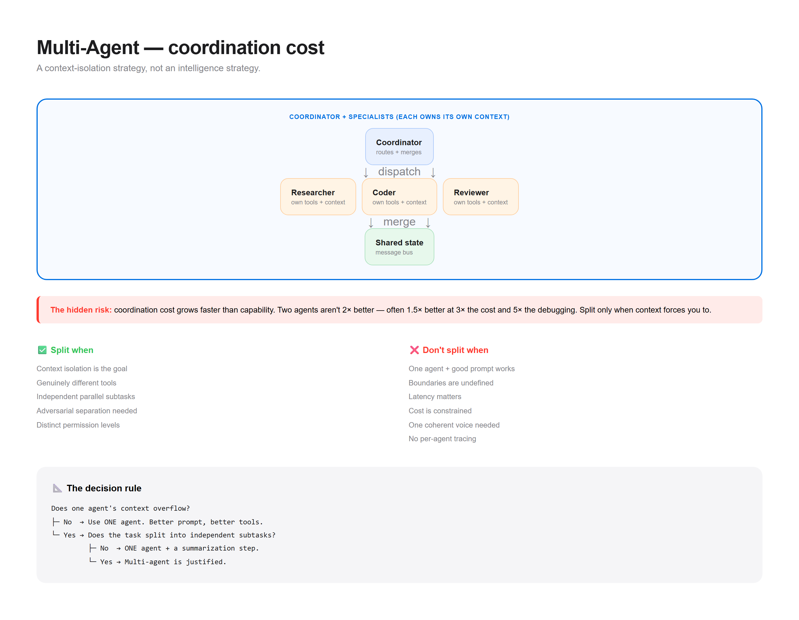

# Pattern 03 — Multi-Agent

> **The confusion:** "Do I actually need multiple agents, or one good loop?"



---

## What is it?

Multi-agent splits a task across several specialized agents instead of one general one. Each agent gets its own prompt, tools, and context — then a coordinator routes work between them.

```
                    ┌─────────────────┐
                    │   Coordinator   │
                    │  (routes + merges)│
                    └────────┬────────┘
                             │
          ┌──────────────────┼──────────────────┐
          ▼                  ▼                  ▼
   ┌────────────┐     ┌────────────┐     ┌────────────┐
   │  Agent A   │     │  Agent B   │     │  Agent C   │
   │ researcher │     │  coder     │     │  reviewer  │
   │ own tools  │     │ own tools  │     │ own tools  │
   │ own context│     │ own context│     │ own context│
   └─────┬──────┘     └─────┬──────┘     └─────┬──────┘
         │                  │                  │
         └──────────────────┼──────────────────┘
                            ▼
                   ┌─────────────────┐
                   │  Shared state   │
                   │  (message bus)  │
                   └─────────────────┘
```

**The key insight:** multi-agent is a *context-isolation* strategy, not an intelligence strategy. You split agents when one context window gets polluted — not because "more agents = smarter."

---

## When do I use it?

✅ **Context isolation is the goal** — a researcher's 50k tokens of search results shouldn't pollute the coder's context
✅ **Genuinely different tools** — the researcher needs web search, the coder needs a sandbox
✅ **Parallel work** — independent subtasks that can run simultaneously
✅ **Adversarial separation** — a reviewer that must NOT see the writer's reasoning, only the output
✅ **Distinct permission levels** — read-only agent vs write-capable agent

---

## When do I NOT use it?

❌ **One agent with a good prompt would work** → the most common mistake. Multi-agent adds coordination overhead for zero gain on simple tasks.

❌ **You can't define the boundaries** → if you can't say exactly what each agent owns, they'll overlap and duplicate work.

❌ **Latency matters** → every handoff is a round-trip. Three agents in sequence = 3x the latency of one.

❌ **Cost is a constraint** → N agents = N system prompts, N tool schemas, N sets of tokens. Costs multiply.

❌ **The task needs one coherent voice** → writing, branding, anything with a unified tone. Multiple agents produce inconsistent output.

❌ **You have no observability** → debugging a multi-agent failure without per-agent traces is nearly impossible. Build tracing first.

❌ **The task fits in one context window** → if it all fits, splitting it only loses information.

---

## The tradeoffs

| Dimension | Cost of going multi-agent |
|-----------|--------------------------|
| **Latency** | Serial handoffs multiply round-trips |
| **Cost** | N system prompts + N tool schemas + coordination tokens |
| **Complexity** | Routing, state sharing, error propagation, termination |
| **Debugging** | Failures are emergent — hard to attribute to one agent |
| **Reliability** | More moving parts = more ways to fail |
| **Consistency** | Multiple voices drift from one coherent output |

**The hidden risk:** **coordination cost grows faster than capability.** Two agents aren't 2x better — they're often 1.5x better with 3x the cost and 5x the debugging. The sweet spot is usually **one agent + good tools** until you hit a hard context limit.

---

## Runnable demo

See [`demo.py`](./demo.py) — a coordinator with two specialist agents, showing when splitting helps and when it just adds overhead. Stdlib only.

```bash
python demo.py
```

---

## Design checklist

- [ ] Can I articulate **exactly what each agent owns**?
- [ ] Is the split for **context isolation**, or just "feels cleaner"?
- [ ] Do I have **per-agent tracing** to debug failures?
- [ ] Is there a **termination condition** (no infinite agent loops)?
- [ ] What happens when **one agent fails** — does the whole thing collapse?
- [ ] Am I paying **coordination cost** for real capability gain?
- [ ] Could **one agent with better tools** do this instead?

If you can't answer #7, you probably don't need multi-agent.

---

## The decision rule

```
Does one agent's context overflow?
├─ No  → Use ONE agent. Better prompt, better tools.
└─ Yes → Does the task split into independent subtasks?
         ├─ No  → Use ONE agent with a summarization step.
         └─ Yes → Multi-agent is justified.
```

Most teams jump to multi-agent at step 1. Start at the top.

---

## Common topologies

| Topology | Shape | Use when |
|----------|-------|----------|
| **Sequential** | A → B → C | Pipeline stages |
| **Supervisor** | Coordinator delegates | Mixed subtasks |
| **Hierarchical** | Supervisors of supervisors | Large systems only |
| **Peer / debate** | Agents critique each other | High-stakes decisions |
| **Blackboard** | Shared state, all read/write | Emergent collaboration |

Start sequential. Add a supervisor only when routing gets conditional.

---

**Next:** [Memory →](../04-memory/)
