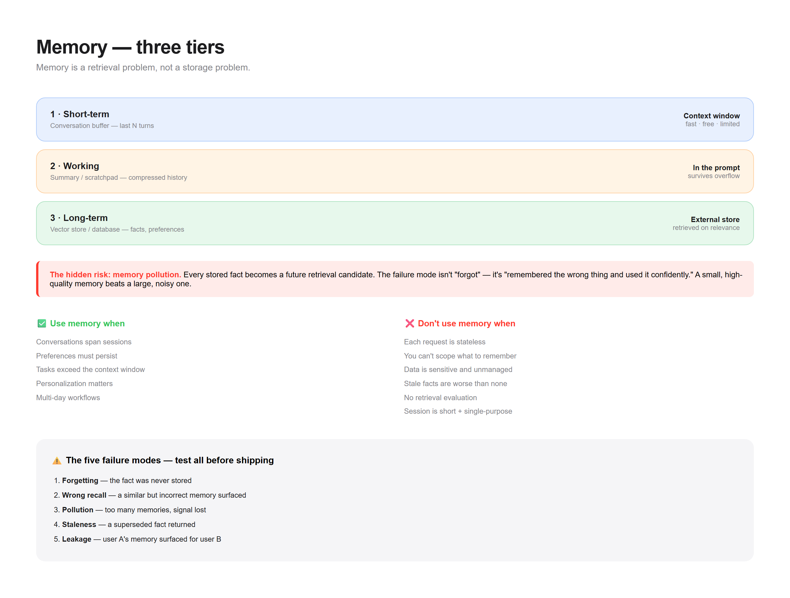

# Pattern 04 — Memory

> **The confusion:** "Where does state live across turns?"



---

## What is it?

Memory is how a stateless model *appears* to remember. The model itself holds nothing — you re-inject the relevant past on every call.

```
┌──────────────────────────────────────────────────────┐
│                   MEMORY TIERS                        │
├──────────────────────────────────────────────────────┤
│                                                       │
│  ┌─────────────────┐  Short-term (context window)     │
│  │ Conversation    │  · last N turns                  │
│  │ buffer          │  · fast, free, limited           │
│  └────────┬────────┘                                  │
│           │                                           │
│  ┌────────▼────────┐  Working (task scratchpad)       │
│  │ Summary /       │  · compressed history            │
│  │ scratchpad      │  · survives context overflow     │
│  └────────┬────────┘                                  │
│           │                                           │
│  ┌────────▼────────┐  Long-term (external store)      │
│  │ Vector store /  │  · facts, preferences, history   │
│  │ database        │  · retrieved on relevance        │
│  └─────────────────┘                                  │
│                                                       │
└──────────────────────────────────────────────────────┘
        ▲                                    │
        │            each turn               │
        └────── retrieve ◄─── model ───► store
```

**The key insight:** memory is a **retrieval problem**, not a storage problem. Storing everything is easy; surfacing the *right* thing at the *right* turn is the hard part.

---

## When do I use it?

✅ **Conversations span sessions** — the user shouldn't repeat themselves
✅ **Preferences must persist** — "I always want metric units"
✅ **Long tasks exceed the context window** — summarize and continue
✅ **Personalization matters** — remembered context improves the product
✅ **The agent needs continuity** — multi-day workflows

---

## When do I NOT use it?

❌ **Each request is stateless** → a translator or calculator needs no memory. Adding it is pure overhead.

❌ **You can't scope what to remember** → "remember everything" becomes a retrieval-noise problem. You'll surface irrelevant memories and degrade quality.

❌ **The data is sensitive and unmanaged** → memory = persistent PII. If you can't handle deletion and access control, don't store it.

❌ **Stale facts are worse than none** → a remembered "current price" from last month is actively harmful.

❌ **You have no retrieval evaluation** → if you can't measure whether the right memory surfaced, you're guessing.

❌ **The session is short and single-purpose** → most requests are. Don't build memory infrastructure for them.

---

## The tradeoffs

| Dimension | Cost of adding memory |
|-----------|----------------------|
| **Latency** | +embedding + retrieval per turn |
| **Cost** | Storage + embedding + extra prompt tokens |
| **Complexity** | Write policy, retrieval policy, eviction, dedup |
| **Failure surface** | Wrong memory retrieved → confidently wrong answer |
| **Privacy** | Persistent PII needs deletion + access control |
| **Staleness** | Old facts silently mislead |

**The hidden risk:** **memory pollution**. Every fact you store becomes a future retrieval candidate. Store too much and the signal drowns in noise. The failure mode isn't "forgot" — it's "remembered the wrong thing and used it confidently." Curate aggressively; a small, high-quality memory beats a large, noisy one.

---

## Runnable demo

See [`demo.py`](./demo.py) — a three-tier memory with relevance-based retrieval and an eviction policy. Stdlib only.

```bash
python demo.py
```

---

## Design checklist

- [ ] What's my **write policy** — what's worth remembering?
- [ ] What's my **retrieval policy** — how do I pick the top-k?
- [ ] What's my **eviction policy** — what gets dropped when full?
- [ ] Do I **deduplicate** before storing?
- [ ] How do I **handle stale facts** (updates, contradictions)?
- [ ] Can a user **view and delete** their memory?
- [ ] Have I measured **retrieval precision** (right memory surfaced)?
- [ ] What's my **scope** — per-user, per-session, per-org?

If you can't answer #7, memory is a liability, not a feature.

---

## The three tiers

| Tier | Lives in | Lifespan | Cost | Use for |
|------|----------|----------|------|---------|
| **Short-term** | Context window | This call | Free | Recent turns |
| **Working** | Summarized prompt | This task | Cheap | Compressed history |
| **Long-term** | External store | Forever | Retrieval cost | Facts, preferences |

**Rule:** start with short-term only. Add a summary layer when you overflow. Add long-term only when sessions must persist.

---

## The failure modes (name them)

1. **Forgetting** — the fact was never stored
2. **Wrong recall** — a similar but incorrect memory surfaced
3. **Pollution** — too many memories, signal lost
4. **Staleness** — a superseded fact returned
5. **Leakage** — user A's memory surfaced for user B

Test all five before shipping.

---

**Next:** [Evals →](../05-evals/)
