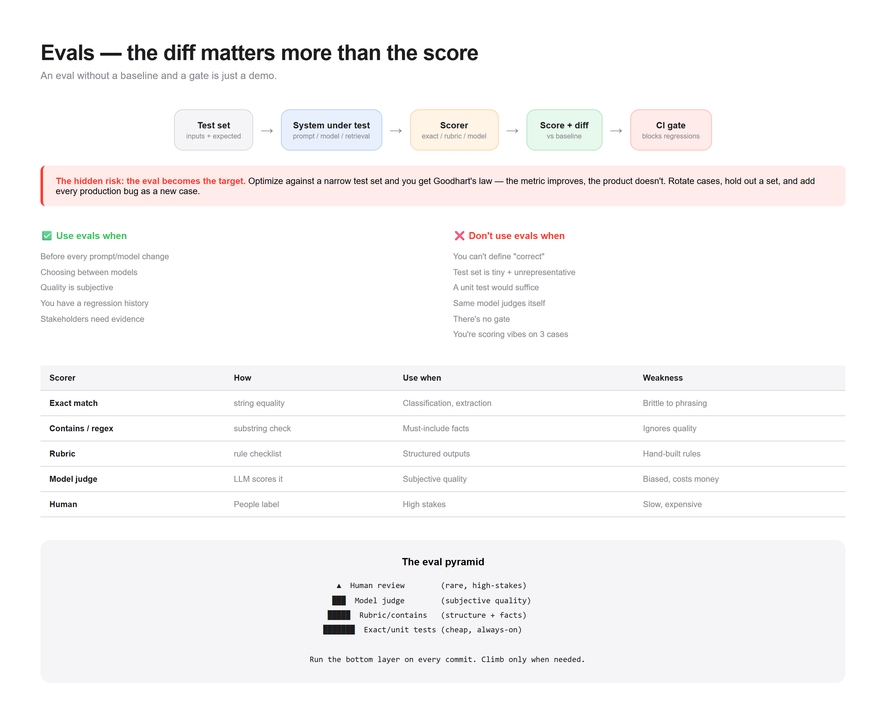

# Pattern 05 — Evals

> **The confusion:** "How do I know it got worse?"



---

## What is it?

Evals turn "it feels better" into a number you can track. You build a dataset, define a scoring method, and run it on every change — so regressions surface before users find them.

```
┌──────────────┐   ┌──────────────┐   ┌──────────────┐
│  Test set    │──▶│   System     │──▶│   Scorer     │
│  (inputs +   │   │  under test  │   │  (exact /    │
│   expected)  │   │              │   │   rubric /   │
└──────────────┘   └──────────────┘   │   model)     │
                                       └──────┬───────┘
                                              ▼
                                       ┌──────────────┐
                                       │   Score      │
                                       │   + diff vs  │
                                       │   baseline   │
                                       └──────┬───────┘
                                              ▼
                                       ┌──────────────┐
                                       │  Gate: pass? │
                                       │  (CI blocks) │
                                       └──────────────┘
```

**The key insight:** without a baseline and a gate, an eval is just a demo. The value isn't the score — it's the **diff** against the last known-good run.

---

## When do I use it?

✅ **Before every prompt/model/retrieval change** — the whole point
✅ **You're choosing between models** — measure, don't guess
✅ **Quality is subjective** — writing, summarization, tone
✅ **You have a regression history** — something broke before
✅ **Stakeholders need evidence** — a number beats an opinion

---

## When do I NOT use it?

❌ **You can't define "correct"** → if you can't articulate what good looks like, you'll build a meaningless metric.

❌ **The test set is tiny and unrepresentative** → 5 hand-picked examples that all pass tells you nothing. Evals lie when the data is narrow.

❌ **The output is deterministic and verifiable** → if a unit test suffices, use the unit test. Don't build an LLM-judge for `2+2`.

❌ **You score with the same model you're testing** → self-evaluation is biased toward its own outputs. Use a different judge or human labels.

❌ **You have no gate** → an eval nobody acts on is decoration.

❌ **You're evaluating vibes on 3 examples** → that's a demo, not an eval. Don't call it one.

---

## The tradeoffs

| Dimension | Cost of adding evals |
|-----------|---------------------|
| **Time** | Building datasets + scorers + review |
| **Cost** | Judge model calls (or human labeling) |
| **Complexity** | Another pipeline to maintain |
| **Maintenance** | Test sets drift; expected outputs go stale |
| **False confidence** | A passing eval on narrow data is misleading |

**The hidden risk:** **the eval becomes the target.** Optimize against a narrow test set and you get Goodhart's law — the metric improves, the product doesn't. Rotate cases, hold out a set, and keep adding failures you discover in production. **Every production bug becomes a new eval case.**

---

## Runnable demo

See [`demo.py`](./demo.py) — a tiny eval harness with three scorer types (exact, contains, rubric) and a baseline gate. Stdlib only.

```bash
python demo.py
```

---

## Design checklist

- [ ] Do I have a **held-out set** (not used for tuning)?
- [ ] Are my cases **representative** of real inputs?
- [ ] Is my **scorer** appropriate to the task type?
- [ ] Is the judge **different** from the system under test?
- [ ] Do I track the **diff vs baseline**, not just the score?
- [ ] Does a regression **block the change** (CI gate)?
- [ ] Do I **add every production failure** as a new case?
- [ ] Have I tested the eval itself on **known-good and known-bad** outputs?

If you can't answer #8, your eval might not measure what you think.

---

## Scorer types

| Type | How | Use when | Weakness |
|------|-----|----------|----------|
| **Exact match** | string equality | Classification, extraction | Brittle to phrasing |
| **Contains / regex** | substring check | Must-include facts | Ignores quality |
| **Rubric** | rule checklist | Structured outputs | Hand-built rules |
| **Model judge** | LLM scores it | Subjective quality | Biased, costs money |
| **Human** | People label | High stakes | Slow, expensive |

**Rule:** use the cheapest scorer that catches the failure you care about. Escalate to a model judge only for genuinely subjective quality.

---

## The eval pyramid

```
        ▲  Human review (rare, high-stakes)
       ███
      █████  Model judge (subjective quality)
     ███████
    █████████  Rubric / contains (structure + facts)
   ███████████
  █████████████  Exact match / unit tests (cheap, always-on)
```

Run the bottom layer on every commit. Climb only when needed.

---

**Next:** [Guardrails →](../06-guardrails/)
