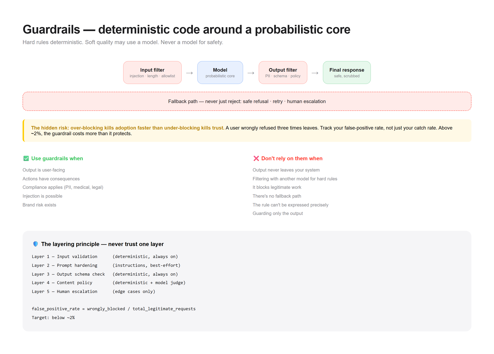

# Pattern 06 — Guardrails

> **The confusion:** "How do I stop bad outputs before they ship?"



---

## What is it?

Guardrails are checks placed **around** the model — before the input reaches it, and after the output leaves it. They catch what the model shouldn't do, regardless of what it was asked.

```
   Input                                             Output
     │                                                 ▲
     ▼                                                 │
┌──────────┐   ┌──────────┐   ┌──────────┐   ┌──────────┐
│  Input   │──▶│  Model   │──▶│  Output  │──▶│  Final   │
│  filter  │   │          │   │  filter  │   │  response│
└──────────┘   └──────────┘   └──────────┘   └──────────┘
     │                             │
     │ reject                      │ reject / rewrite
     ▼                             ▼
┌──────────────────────────────────────────────────────┐
│  Fallback: safe refusal, retry, or human escalation  │
└──────────────────────────────────────────────────────┘
```

**The key insight:** guardrails are **deterministic code around a non-deterministic core**. The model is probabilistic; your checks are not. That contrast is what makes the system safe.

---

## When do I use it?

✅ **The output is user-facing** — anything a person reads
✅ **Actions have consequences** — payments, emails, deletions
✅ **Compliance applies** — PII, medical, financial, legal
✅ **Injection is possible** — untrusted input or tool results
✅ **Brand risk exists** — tone, claims, competitors

---

## When do I NOT use it?

❌ **The output never leaves your system** → an internal scratchpad doesn't need a tone filter.

❌ **You're filtering with another model** → an LLM guard is probabilistic and can be bypassed. Use deterministic checks for hard rules; reserve model judges for soft quality.

❌ **The guardrail blocks legitimate work** → over-blocking is a real failure. A guardrail that refuses valid requests destroys trust.

❌ **You have no fallback path** → a guardrail that only rejects leaves the user stuck. Always define what happens instead.

❌ **The rule can't be expressed precisely** → "don't be offensive" is not a check. Either define it operationally or use human review.

❌ **You put guardrails only on the output** → injection happens at the *input* and *tool-result* boundary. Guard both ends.

---

## The tradeoffs

| Dimension | Cost of adding guardrails |
|-----------|--------------------------|
| **Latency** | +every check in the path |
| **Cost** | Model-based judges add calls |
| **False positives** | Legitimate requests blocked |
| **Complexity** | Rules to maintain, tune, and version |
| **Coverage illusion** | A passing check ≠ safe system |

**The hidden risk:** **over-blocking kills adoption faster than under-blocking kills trust.** A user who gets wrongly refused three times leaves. Measure your false-positive rate, not just your catch rate. A guardrail you can't tune is a liability.

---

## Runnable demo

See [`demo.py`](./demo.py) — input + output guardrails with a fallback path and a false-positive tracker. Stdlib only.

```bash
python demo.py
```

---

## Design checklist

- [ ] Am I guarding **both input and output**?
- [ ] Are hard rules **deterministic** (not model-judged)?
- [ ] Is there a defined **fallback** (not just rejection)?
- [ ] Do I measure **false positives** as well as catches?
- [ ] Do I guard **tool results** (injection vector)?
- [ ] Are rules **versioned** and testable?
- [ ] Is there a **human escalation** path for edge cases?
- [ ] Have I tested **bypass attempts** (adversarial inputs)?

If you can't answer #4, you don't know your guardrail's real cost.

---

## Guardrail types

| Type | Where | Method | Reliability |
|------|-------|--------|-------------|
| **Schema** | Output | JSON/type validation | Deterministic |
| **Allowlist** | Input | Known-good only | Deterministic |
| **Denylist** | Both | Block known-bad | Deterministic (brittle) |
| **PII scrub** | Both | Pattern + entity match | Deterministic |
| **Model judge** | Output | LLM scores quality | Probabilistic |
| **Human** | Escalation | Review queue | Reliable, slow |

**Rule:** hard rules deterministic. Soft quality may use a model judge. Never rely on a model for a safety-critical rule.

---

## The layering principle

```
Layer 1 — Input validation      (deterministic, always on)
Layer 2 — Prompt hardening      (instructions, best-effort)
Layer 3 — Output schema check   (deterministic, always on)
Layer 4 — Content policy        (deterministic + model judge)
Layer 5 — Human escalation      (edge cases only)
```

Each layer catches what the one above missed. Never trust a single layer.

---

## The false-positive budget

Track this number:

```
false_positive_rate = wrongly_blocked / total_legitimate_requests
```

If it's above ~2%, your guardrail is costing you more than it protects. Tune it down before adding more rules.

---

**Next:** [Context Engineering →](../07-context-engineering/)
