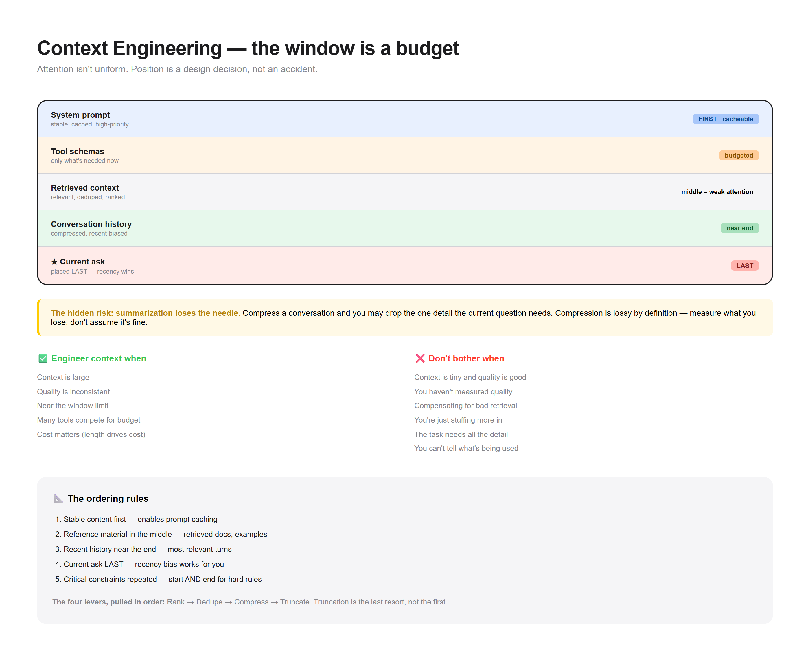

# Pattern 07 — Context Engineering

> **The confusion:** "Why does it forget the middle of my prompt?"



---

## What is it?

Context engineering is the deliberate arrangement of everything the model sees: system prompt, retrieved docs, tool schemas, history, and the current ask. It treats the context window as a **scarce resource to be budgeted**, not a bucket to be filled.

```
┌───────────────────────────────────────────────────────┐
│              CONTEXT WINDOW (budgeted)                 │
├───────────────────────────────────────────────────────┤
│ ┌───────────────────────────────────────────────────┐ │
│ │ System prompt        │ stable, cached, high-priority│
│ ├───────────────────────────────────────────────────┤ │
│ │ Tool schemas         │ only what's needed now       │
│ ├───────────────────────────────────────────────────┤ │
│ │ Retrieved context    │ relevant, deduped, ranked    │
│ ├───────────────────────────────────────────────────┤ │
│ │ Conversation history │ compressed, recent-biased    │
│ ├───────────────────────────────────────────────────┤ │
│ │ ★ Current ask        │ placed LAST (recency wins)   │
│ └───────────────────────────────────────────────────┘ │
└───────────────────────────────────────────────────────┘
```

**The key insight:** attention isn't uniform. Models attend most strongly to the **beginning and end** of context, and weakly to the middle — the "lost in the middle" effect. Position is a design decision, not an accident.

---

## When do I use it?

✅ **The context is large** — many docs, long history, many tools
✅ **Quality is inconsistent** — sometimes great, sometimes forgetful
✅ **You're near the window limit** — every token counts
✅ **You have many tools** — schemas consume budget
✅ **Cost matters** — context length drives cost directly

---

## When do I NOT use it?

❌ **The context is tiny** → if it all fits comfortably and quality is good, you're already done. Don't over-engineer.

❌ **You haven't measured quality** → rearranging without measuring is superstition.

❌ **You're compensating for a bad retrieval layer** → if retrieval returns garbage, no arrangement fixes it. Fix retrieval first.

❌ **You're just stuffing more in** → a bigger context window is not a solution to poor relevance. More tokens can mean more noise.

❌ **The task needs all the detail** → summarizing away a legal document to save tokens loses the thing that mattered.

❌ **You can't tell what's actually being used** → without tracing, you're guessing at what the model saw.

---

## The tradeoffs

| Dimension | Cost of context engineering |
|-----------|----------------------------|
| **Effort** | Ordering, compression, dedup all take work |
| **Risk** | Compressing too hard loses critical detail |
| **Complexity** | Another layer to maintain and test |
| **Caching** | Reordering breaks prompt caching |
| **Over-tuning** | Optimizing for your test set, not reality |

**The hidden risk:** **summarization loses the needle.** Compress a conversation and you may drop the one detail the current question needs. Compression is lossy by definition — measure what you lose, don't assume it's fine.

---

## Runnable demo

See [`demo.py`](./demo.py) — a context budgeter that ranks, dedupes, and positions sections under a token cap. Stdlib only.

```bash
python demo.py
```

---

## Design checklist

- [ ] Do I have a **token budget** per section?
- [ ] Is the **current ask positioned last**?
- [ ] Are **stable sections first** (for prompt caching)?
- [ ] Do I **deduplicate** retrieved content?
- [ ] Am I **ranking** by relevance before truncating?
- [ ] Do I know my **lost-in-the-middle risk**?
- [ ] Have I measured quality **with and without** each section?
- [ ] Do I trace **what actually went into the prompt**?

If you can't answer #7, you don't know which sections earn their tokens.

---

## The ordering rules

1. **Stable content first** — system prompt, tool schemas (enables caching)
2. **Reference material in the middle** — retrieved docs, examples
3. **Recent history near the end** — most relevant turns
4. **Current ask last** — recency bias works in your favor
5. **Critical constraints repeated** — start *and* end for hard rules

---

## The four levers

| Lever | What it does | When to pull |
|-------|-------------|--------------|
| **Rank** | Put best content first | Always |
| **Dedupe** | Remove repeats | Retrieved content overlaps |
| **Compress** | Summarize history | Long conversations |
| **Truncate** | Drop the least relevant | Near the limit |

Pull them in that order. Truncation is the last resort, not the first.

---

## The measurement rule

Never reorder or compress without a before/after eval:

```
quality(with change) vs quality(baseline)
```

Context engineering without measurement is just moving text around and hoping. Every change needs a number attached.

---

**Next:** [Cost & Latency Budgets →](../08-cost-latency-budgets/)
