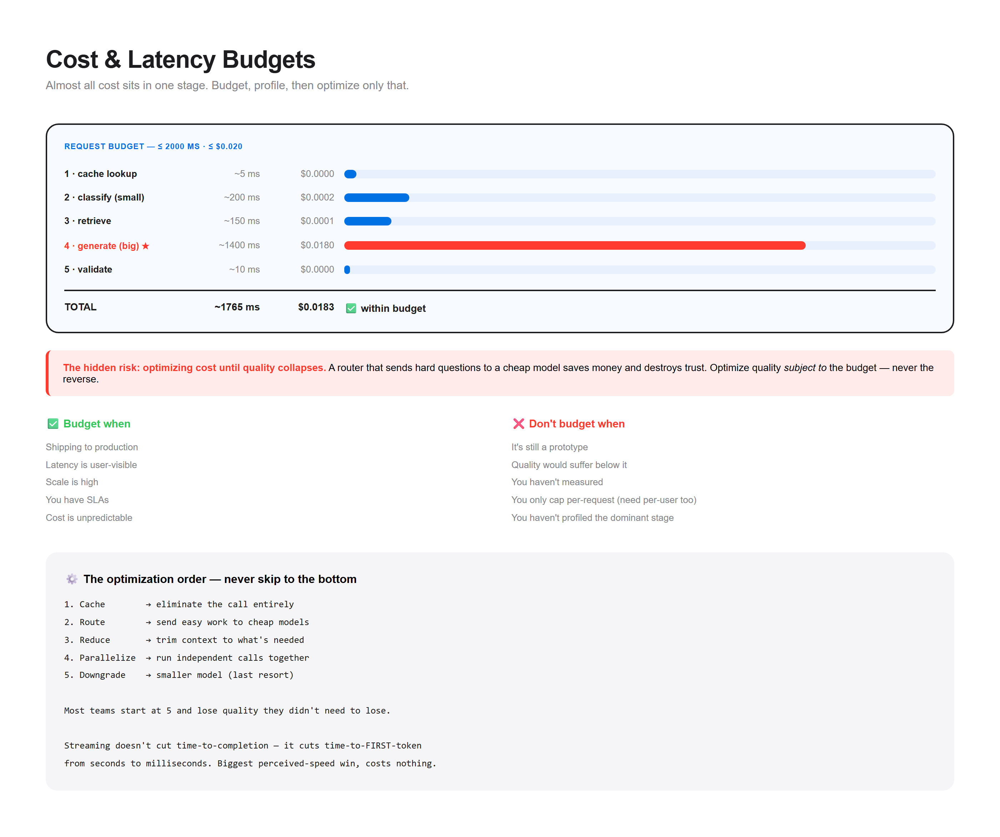

# Pattern 08 — Cost & Latency Budgets

> **The confusion:** "Why is this slow and expensive?"



---

## What is it?

A budget makes cost and latency **explicit constraints** instead of surprises. You decide up front what a request may spend — in tokens, dollars, and milliseconds — then design the system to stay inside it.

```
┌──────────────────────────────────────────────────────┐
│                REQUEST BUDGET                         │
├──────────────────────────────────────────────────────┤
│  Latency:  ≤ 2000 ms total                            │
│  Cost:     ≤ $0.02 per request                        │
│  Tokens:   ≤ 8000 input / 1000 output                 │
├──────────────────────────────────────────────────────┤
│                                                       │
│  Stage 1  cache lookup      ~5 ms    $0.000          │
│  Stage 2  classify (small)  ~200 ms  $0.0002         │
│  Stage 3  retrieve          ~150 ms  $0.0001         │
│  Stage 4  generate (big)    ~1400 ms $0.018  ◀ big   │
│  Stage 5  validate          ~10 ms   $0.000          │
│  ─────────────────────────────────────────────────   │
│  TOTAL                      ~1765 ms $0.0183  ✅      │
│                                                       │
└──────────────────────────────────────────────────────┘
```

**The key insight:** almost all cost and latency sits in **one or two stages**. Budget first, then find the dominant stage, then optimize only that. Optimizing a 5ms stage is wasted effort.

---

## When do I use it?

✅ **You're shipping to production** — budgets prevent runaway bills
✅ **Latency is user-visible** — chat, search, interactive tools
✅ **Scale is high** — small per-request cost × millions matters
✅ **You have SLAs** — a target you must hit
✅ **Cost is unpredictable** — you need a ceiling, not an average

---

## When do I NOT use it?

❌ **It's a prototype** → optimizing before product-market fit is premature. Ship, then budget.

❌ **Quality would suffer below the budget** → if the task genuinely needs the tokens, cut scope or accept the cost. Never silently degrade quality to hit a number.

❌ **You haven't measured** → a budget without measurement is a guess. Profile first.

❌ **The budget is per-request only** → you also need a **per-user and per-day** cap, or one abusive user burns your margin.

❌ **You're optimizing the wrong stage** → profile before optimizing. The slow part is rarely what you assume.

❌ **Caching is possible but skipped** → the cheapest call is the one you don't make.

---

## The tradeoffs

| Dimension | Cost of tight budgets |
|-----------|----------------------|
| **Quality** | Fewer tokens → less context → worse answers |
| **Complexity** | Routing, caching, tiering all add code |
| **Engineering** | More moving parts to maintain |
| **Rigidity** | A hard cap can fail valid requests |
| **Over-optimization** | Saving cents while losing dollars of value |

**The hidden risk:** **optimizing cost until quality collapses.** A model router that sends hard questions to a cheap model saves money and destroys trust. Cost is a constraint, not the objective. Optimize quality *subject to* the budget — never the reverse.

---

## Runnable demo

See [`demo.py`](./demo.py) — a request pipeline with per-stage timing, a budget gate, and a caching layer that shows the real savings. Stdlib only.

```bash
python demo.py
```

---

## Design checklist

- [ ] Do I have a **per-request** budget (latency + cost)?
- [ ] Do I have a **per-user / per-day** cap?
- [ ] Have I **profiled** which stage dominates?
- [ ] Is there a **cache** in front of the expensive call?
- [ ] Do I **route** simple requests to cheaper paths?
- [ ] What happens when the budget is **exceeded** (degrade? fail? queue?)
- [ ] Do I **log** cost and latency per request?
- [ ] Have I checked that quality holds **inside** the budget?

If you can't answer #6, your budget is a wish, not a control.

---

## The optimization order

Always in this order:

```
1. Cache        → eliminate the call entirely
2. Route        → send easy work to cheap models
3. Reduce       → trim context to what's needed
4. Parallelize  → run independent calls together
5. Downgrade    → smaller model (last resort)
```

Never start at step 5. Most teams do, and lose quality they didn't need to lose.

---

## The latency breakdown

| Stage | Typical | Optimized by |
|-------|---------|--------------|
| Network | 20–200 ms | Region placement, connection reuse |
| Retrieval | 50–300 ms | Index tuning, caching |
| Model | 500–5000 ms | Smaller model, streaming, parallelism |
| Validation | 5–50 ms | Deterministic checks |
| **Model = 70–90%** | | **Optimize here** |

---

## The streaming rule

Perceived latency ≠ actual latency.

Streaming doesn't reduce time-to-completion, but it cuts **time-to-first-token** from seconds to milliseconds. For user-facing chat, stream — it's the single biggest perceived-speed win, and it costs nothing.

---

**Back to:** [All patterns →](../../README.md)
